# NeoShell 下载与更新

NeoShell 是跨平台 SSH 终端和 SFTP 文件管理工具。本仓库只存放公开安装包、校验值和版本说明。

**[获取最新版本](https://github.com/niujt/NeoSHELL-Releases/releases/latest)**

v0.3.1 更新为更简洁的黑白界面，采用全新 Shell/SFTP 标识。左下角可切换浅色与深色主题，应用会记住选择。

- Windows：下载 x64 NSIS 安装版 `.exe`。
- macOS Apple Silicon（M 系列）：下载 arm64 DMG，将 NeoShell 拖入 Applications。
- 退出旧版再覆盖安装，原有连接、凭据和工作区保留。无需删除应用数据。

v0.3.0 起，可通过 **设置 → 应用更新** 或 **帮助 → 检查更新** 获取对应系统的下载链接。默认启动时检查一次，也可在设置中关闭。检查更新无需 GitHub 账号，不上传服务器连接信息。

当前安装包未作 Windows 代码签名；macOS 使用临时签名，未经 Apple 公证。Intel Mac 暂无安装包。

版本说明包含改动范围和验证边界。SHA256SUMS.txt 可用于核对下载文件是否完整。

## 界面与功能截图

截图来自 v0.3.1 的真实 Electron 窗口，展示新版黑白界面与 Shell/SFTP 标识。连接、命令输出和文件均为独立的本地 SSH/SFTP 演示数据。

### 浅色首页

连接列表、最近会话和传输状态集中在工作区首页。

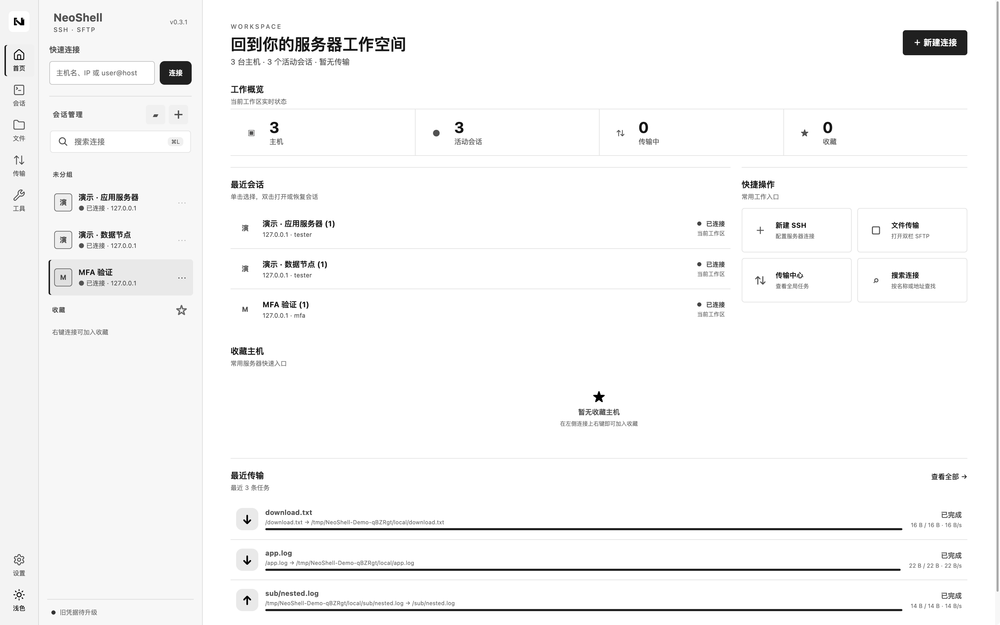

### 深色首页

保持相同布局与新标识，切换为黑底白字。

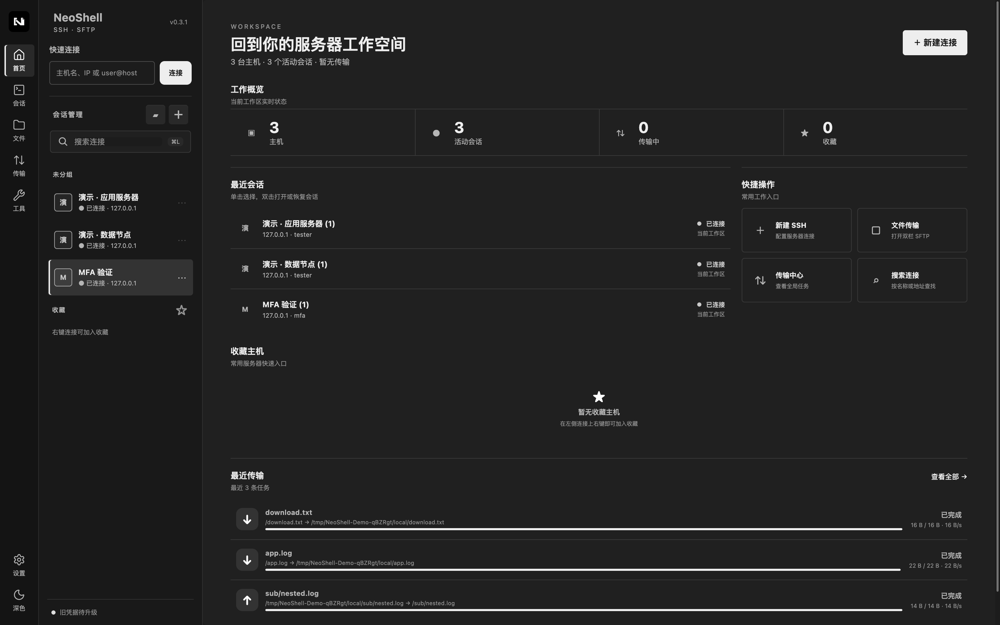

### 终端分屏 · 浅色

两个 SSH 会话并排显示，保留终端 ANSI 彩色输出。

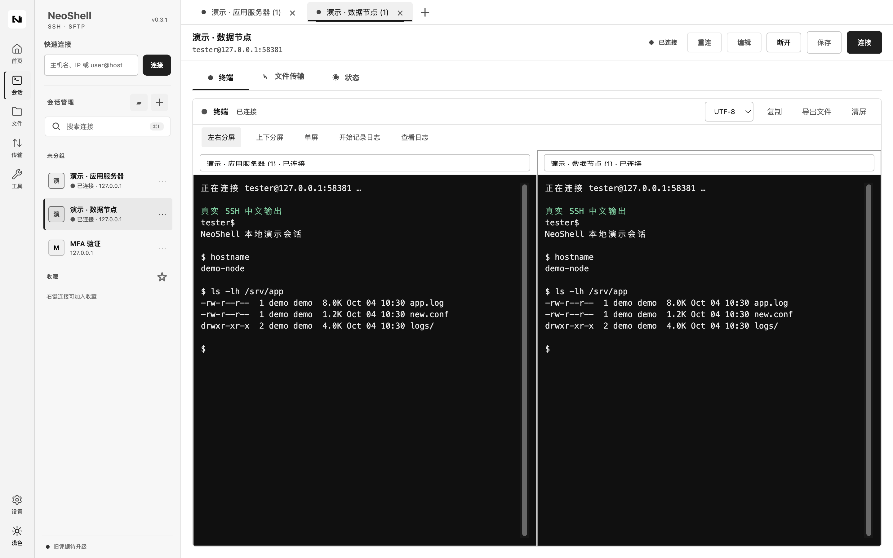

### 终端分屏 · 深色

深色主题下的多会话终端工作区。

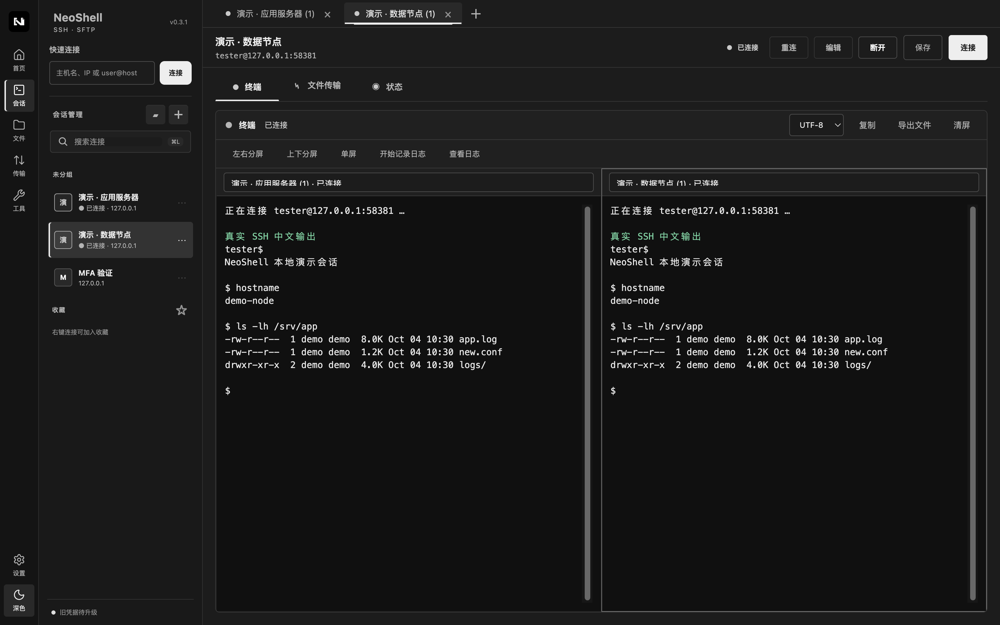

### 命令片段与批量执行

命令片段可保存到本机；选择多个已连接会话执行命令，并查看批次状态。

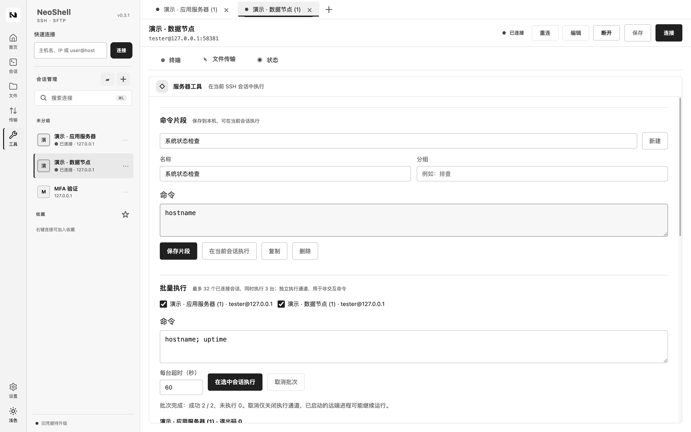

### 双栏 SFTP 与过滤规则

本地与服务器文件并排浏览，支持包含和排除规则。

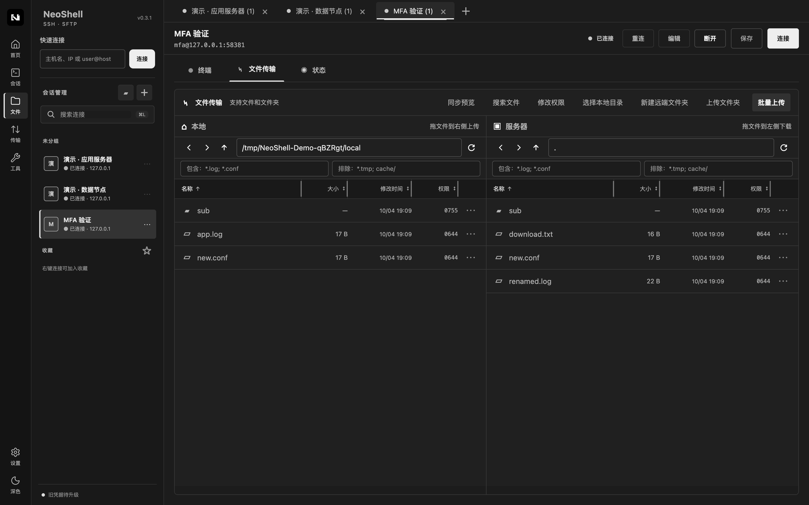

### 文件夹同步预览

执行前查看新增、覆盖和新建目录清单，并选择要处理的差异项。

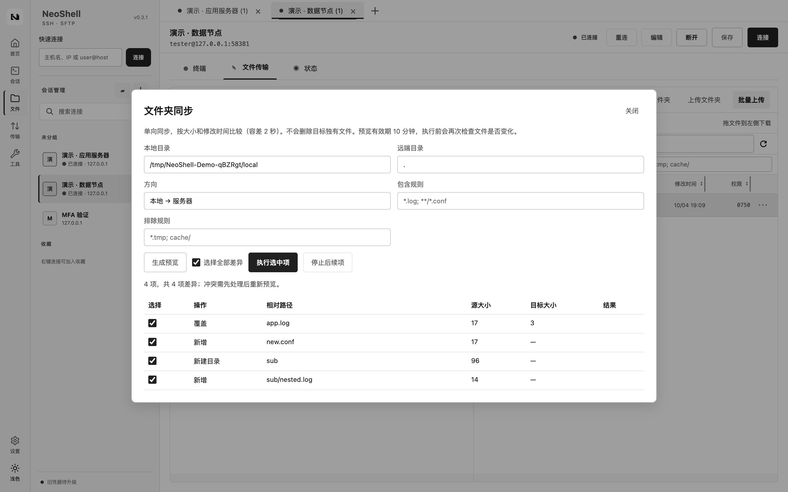

### 远程文件搜索

递归搜索当前远程目录，点击结果打开所在目录。

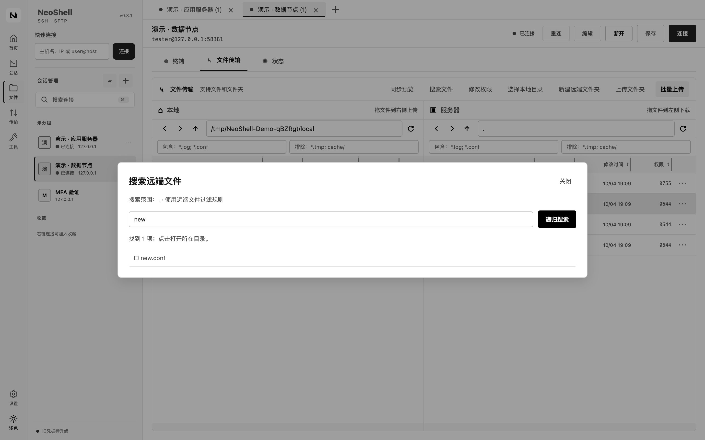

### 图形化权限修改

通过所有者、用户组和其他人的 rwx 选项调整权限，与八进制值联动。

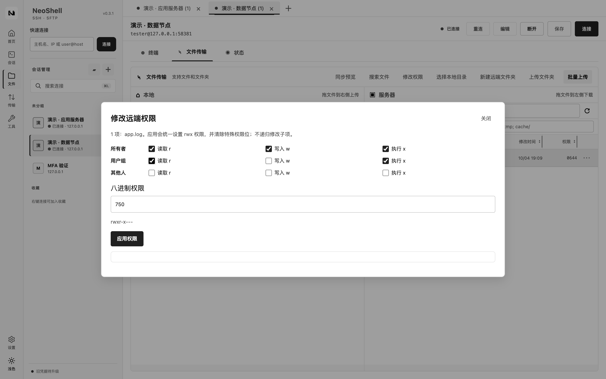

### 会话日志

查看已启用记录的终端输出，并导出选中日志。

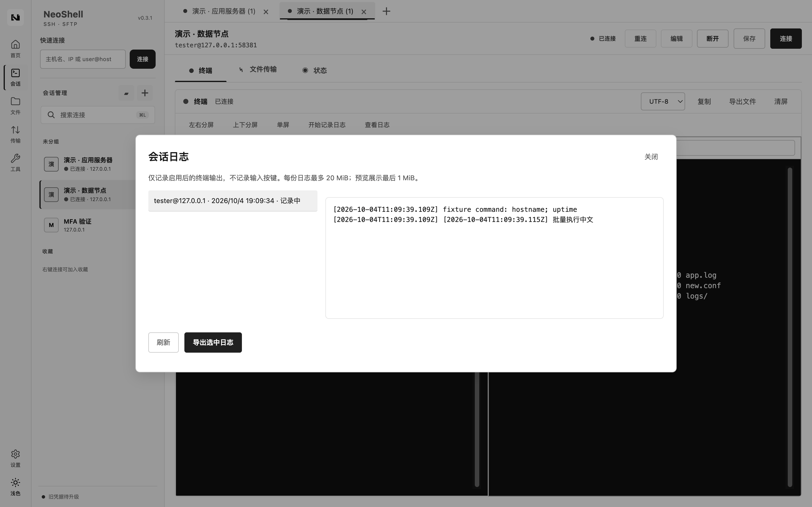

### 设置与 GitHub 更新入口

显示当前版本与 GitHub 正式版状态，提供检查更新和发布页入口。

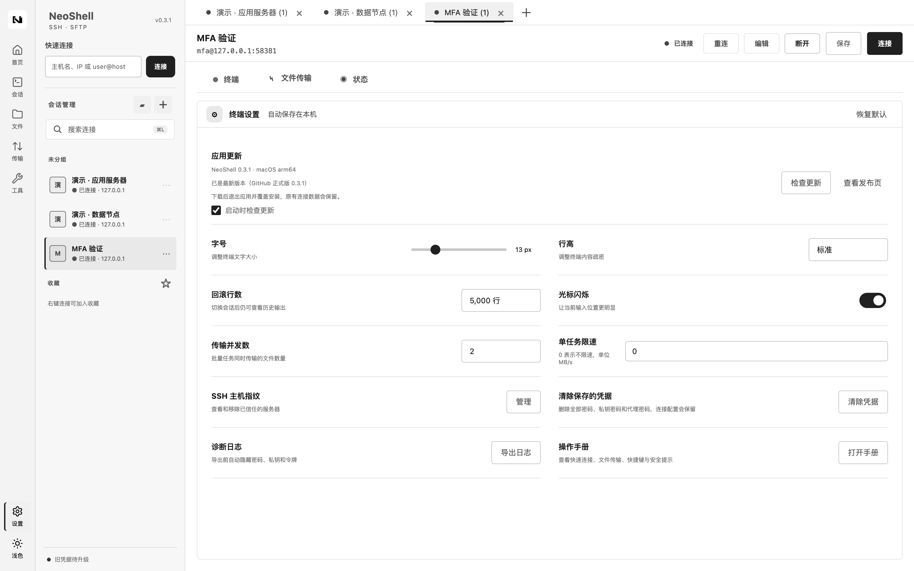
